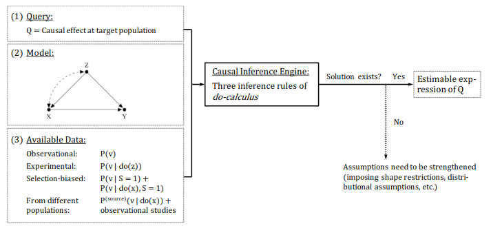

layout: true
  
<div class="my-header"></div>

<!-- the following lines define the header and the footer line: -->
<div class="my-footer"><span>`r params$semester`    
&emsp;&emsp;&emsp;&emsp;&emsp;&emsp;
&emsp;&emsp;&emsp;&emsp;&emsp;&emsp;&emsp;&emsp;&emsp;&emsp;&emsp;&emsp;&emsp;
`r params$instructor` | `r params$foottitle` </span></div> 

<div class="footer-line"></div>


```{r setup, include=FALSE}
library(emojifont)
library(knitr)

library(ggdag)


# House Price
co <- data.frame(x=c(0,0,1), y=c(1,0,0), name=c("C", "X", "Y")) 

DAG_Immo <- dagify(X ~ C,
       Y ~ X,
       Y ~ C, coords = co) %>% 
  ggdag(node_size = 20, text_size = 8, text = TRUE, text_col = "lightgray") + theme_dag_blank() +
  geom_dag_edges(arrow_directed = grid::arrow(length = grid::unit(15, "pt"), type = "closed"))  + 
  geom_text(label = "C - Living area\nX - Bedrooms \nY - Price", 
            hjust = 1, vjust = 1,
            x = 1, y = 1, size = 7, color = "darkgrey")

# Dating
co <- data.frame(x=c(0,1,2), y=c(1,0,1), name=c("Y","C","X"))

DAG_Date <- dagify(C ~ Y,
                  C ~ X, coords = co) %>% 
  ggdag(node_size = 20, text_size = 8, text = TRUE, text_col = "lightgray") + theme_dag_blank() +
  geom_dag_edges(arrow_directed = grid::arrow(length = grid::unit(15, "pt"), type = "closed"))  + 
  geom_text(label = "Y - Looking\nX - Kindness\nC - Date",
            hjust = 0.5, vjust = 1,
            x = 1, y = 1, size = 7, color = "darkgrey")

# Smoking
# https://ggdag.malco.io/articles/intro-to-dags.html

co <- data.frame(x=c(0,0,-1,1,0), y=c(0,1,2,2,3), name=c("cardiacarrest","cholesterol","smoking", "weight", "unhealthy"))

smoking_ca_dag <- dagify(cardiacarrest ~ cholesterol,
       cholesterol ~ smoking + weight,
       smoking ~ unhealthy,
       weight ~ unhealthy,
       labels = c("cardiacarrest" = "Cardiac\n Arrest", 
                  "smoking" = "Smoking",
                  "cholesterol" = "Cholesterol",
                  "unhealthy" = "Unhealthy\n Lifestyle",
                  "weight" = "Weight"),
       latent = "unhealthy",
       exposure = "smoking",
       outcome = "cardiacarrest",
       coords = co) 

gs.path <- ggdag(smoking_ca_dag, text = FALSE, use_labels = "label")  + theme_dag_blank()

gs.adj <- ggdag_adjustment_set(smoking_ca_dag, text = FALSE, use_labels = "label", shadow = TRUE)  + theme_dag_blank()


library(mosaic)

theme.fom <- theme_classic(22*1.04)
theme.fom <- theme.fom
theme_set(
  theme.fom  
)
options(scipen=999)
```


---

class: center, inverse, middle

# Statistics aims at turning data into understanding, insight, knowledge and to help people make better decisions.


---

## Survey: Inference from data analysis


A (very) short survey: [https://bit.ly/30sJNbm](https://bit.ly/30sJNbm)


```{r echo=FALSE, out.width = "40%", fig.align="center"}

```

---

class: center, inverse, middle

# First Example: Bedrooms and house price


---

## Saratoga Houses

Data on houses in Saratoga County, New York, USA in 2006. Analysis in `R`:

```{r SaratogaSP, out.width = "35%", fig.align="center"}
# Load package and read in data 
library(mosaic); data(SaratogaHouses)
# Scatterplot
gf_point(price ~ bedrooms, data = SaratogaHouses) %>%
  gf_lm(interval = "prediction")
```

.small[Idea: [De Veaux (2019). *Data Science for All*](https://iase-web.org/conference/satellite19/docs/Data%20Science%20for%20All.pdf)]


---

## Modelling value of my 2-bedroom house

Linear Model: ${\text{price}}_i = {\beta}_0 + {\beta}_{\text{bedrooms}} \times \text{bedrooms}_i + \epsilon_i$:

```{r}
# Linear Regression
my.model <- lm(price ~ bedrooms, data = SaratogaHouses); my.model 
```

So: $\hat{\beta}_{\text{bedrooms}}=`r round(coef(my.model)[2],2)`$

--

```{r}
# My house: 2 bedrooms; Point prediction
My.House <- data.frame(bedrooms = 2); predict(my.model, newdata = My.House)
```

$$\widehat{\text{price}}^{|\text{bedrooms}=2} \approx `r round(predict(my.model, newdata = My.House))`$$


---

## Turn data into money

```{r, echo= FALSE , out.width = "15%", fig.align="center"}
ggplot() + geom_emoji("money_mouth_face") + theme_void()
```

Split one bedroom into three!

--

```{r}
# My rebuilt house: now 4 bedrooms
My.NewHouse <- data.frame(bedrooms = 4)
# My money (?)
predict(my.model, newdata = My.NewHouse) - predict(my.model, newdata = My.House)
```

So:

$$\widehat{\text{price}}^{|\text{bedrooms}=4} - \widehat{\text{price}}^{|\text{bedrooms}=2} = (4-2) \times \hat{\beta}_{\text{bedrooms}}=`r 2*round(coef(my.model)[2],2)`$$

---

## Really?

Make three bedrooms out of one and the value of my house goes up by $\approx 100.000$ Dollar?

--

.center[<iframe src="https://giphy.com/embed/xTiTnHXbRoaZ1B1Mo8" width="480" height="271" frameBorder="0" class="giphy-embed" allowFullScreen></iframe>]

.small[[via GIPHY](https://giphy.com/gifs/debate-donald-trump-septgopdebate2015-xTiTnHXbRoaZ1B1Mo8)]


---

## Causal Model (simplified)

The number of bedrooms depends on the house size - as well as the price (**confounding**/ **lurking** variable):

```{r echo=FALSE, out.width = "40%", fig.align="center"}
DAG_Immo
```


---

## Omitted-variable bias

Ok, let's adjust for `livingArea`:

```{r}
my.adj.model <- lm(price ~ bedrooms + livingArea, data = SaratogaHouses); my.adj.model
```

Now: $\hat{\beta}_{\text{bedrooms}}=`r round(coef(my.adj.model)[2],2)`$ (instead of $\hat{\beta}_{\text{bedrooms}}=`r round(coef(my.model)[2],2)`$ unadjusted for ` livingArea`). So: price falls instead of rises if I split a bedroom. (**Simpson's Paradox**)


<br>

--

*Hey, can't I just use e.g. `xgboost` with all variables?*


---

## Fancy machine learning method

```{r, echo= FALSE , out.width = "15%", fig.align="center"}
ggplot() + geom_emoji("thinking") + theme_void()
```

.center[*Hey, can't I just use e.g. `xgboost` with all variables?*]

.small[BTW: `mlr3`: A modern object-oriented machine learning framework in `R` ([Lang et al., 2019](https://joss.theoj.org/papers/10.21105/joss.01903))]

--

```{r, echo= FALSE , out.width = "15%", fig.align="center"}
ggplot() + geom_emoji("cry") + theme_void()
```

Unfortunately: Depending on task **not always** and quantitative measures like e.g. cross-validated mean squared error **not always** tell you which model is best for causal inference. 

.small[BTW: Nice blog: [Landesberg, Davies and Yee (2019). *Want to make good business decisions? Learn causality*](https://multithreaded.stitchfix.com/blog/2019/12/19/good-marketing-decisions/)]


---

class: center, inverse, middle

# Some more words about data science


---

## Data science tasks

-  [Shmueli (2010)](https://projecteuclid.org/euclid.ss/1294167961) asked: *To Explain or to Predict?*

-  [Hernán et al. (2019)](https://doi.org/10.1080/09332480.2019.1579578) distinguished:
   - **Description**: "How can women aged 60–80 years with stroke history be partitioned in classes defined by their characteristics?"
   - **Prediction**: "What is the probability of having a stroke next year for women with certain characteristics?"
   - **Causal inference**: 	"Will starting a statin reduce, on average, the risk of stroke in women with certain characteristics?"

.center[<iframe src="https://giphy.com/embed/A06UFEx8jxEwU" width="240" height="177" frameBorder="0" class="giphy-embed" allowFullScreen></iframe>]

.small[[via GIPHY](https://giphy.com/gifs/code-matrix-wallpaper-A06UFEx8jxEwU)]

---

## Levels of causal inference


[Pearl (2019)](https://doi.org/10.1145/3241036) establishes a three-level hierarchy:

- **Association**: $P(y|x)$: Seeing: *what is?*, i.e., the probability of $Y=y$ given that we observe $X=x$.

- **Intervention**: $P(y|do(x))$: Manipulation: *what if?*, i.e., the probability of $Y=y$ given that we intervene and set the value of $X$ to $x$.

- **Counterfactuals**: $P(y_x|x',y')$: Imagining: *what if I had acted differently?*, i.e., the probability of $Y=y$ if $X$ had been $x$ given that we actually observed $x',y'$.

---

## Statistics and causation

[Witmer (2020)](https://doi.org/10.1080/00029890.2020.1671757):

> The  scientific  community  would  benefit  greatly  from  a  better  understanding of causal inference - and "better" is quite a low bar, given how little the tools of causal reasoning have been used over the years. But statisticians have stood in the way, insisting that cause-and-effect conclusions can only be drawn from randomized experiments and delighting in telling stories about confounded effects that arise when analyzing observational data, all while repeating the  mantra  that correlation is  not  causation. In so doing, we statisticians congratulate ourselves too much, while turning students away from asking and answering questions of genuine interest. At the same time, we hamper the advancement of scientific and societal progress.

<br>

.small[See also the [DAGStat Stellungnahme: Die Rolle der Statistik in der Künstlichen Intelligenz (2020)](https://www.dagstat.de/fileadmin/dagstat/documents/DAGStat_KI_Stellungnahme_200303.pdf) where the relation causation and association is an important topic.]
---

## One page of theory

- $X \rightarrow Y: \quad Y=f(X, U_Y)$ with some function $f(\cdot)$ and some exogenous $U$. 

- The value of $Y$ depends on $X$ - but the value of $X$ **not** on $Y$. 

- Causally there is no inverse function $f^{-1}(\cdot)$. My weight growths with my height but unfortunately my height not with my weight.

<br>


| Path                       | $X \rightarrow C \rightarrow Y$ | $X \leftarrow C \rightarrow Y$ | $X \rightarrow C \leftarrow Y$ 
| ---------------------------|---------------------------------|--------------------------------|------------------------------|
| Name                       | Chain                           | Fork                           | Collider         
| Association $X$ to $Y$     | Causal                          | Non-causal                     | None                       
| Adjusting $C$              | Blocks causal path              | Blocks non-causal path         | Opens non-causal path
| Role of $C$                | Mediator                        | Cause                          | Effect


**Idea**: To estimate the change in $y$ if $x$ is changed: Block non-causal paths, open causal paths and don't open a biasing path.

.small[BTW: Nice tool: [DAGitty](http://dagitty.net/)]

---


class: center, inverse, middle

# A simulated example


---

## Dating

**Assume** you date someone because he is good looking or because he is kind. Moreover assume that looking and kindness are independent.


```{r echo=FALSE, out.width = "40%", fig.align="center"}
DAG_Date
```


---

## Data generating process

$$X = U_X, \quad U_X \sim \mathcal{N}(0,\,1),$$
$$Y = U_Y, \quad U_Y \sim \mathcal{N}(0,\,1),$$
$$\widetilde{C} =\begin{cases} 1 & ,\, \text{if } \{ X > 1 \,\vee\, Y > 1\} \\ 0 & ,\, \text{else } \end{cases},$$
$$C = (1-U_C) \cdot \widetilde{C} + U_C \cdot (1- \widetilde{C}), \quad U_C \sim \mathcal{B}(0.05).$$
where $\mathcal{B}(\pi)$ stands for the Bernoulli distribution.

In `R`:

```{r}
set.seed(1896)

kind<- rnorm(1000)
look <- rnorm(1000)
dating <- ((kind > 1) | (look > 1)) 
luck <- rbinom(1000, size = 1, prob = 0.05)
dating <- (1 - luck) * dating + luck * (1 - dating)
```

```{r, include=FALSE}
Date <- data.frame(kind, look, dating=(dating==1))
```


---

## Modelling: Marginal

Modelling of `kind` by `look`: 

```{r echo=FALSE, out.width = "50%", fig.asp = 0.8, fig.align="center"}
ggformula::gf_point(kind~look, data = Date) %>%
  gf_lm() + ggthemes::scale_color_colorblind()
```


---

## Modelling: Conditional

Modelling of `kind` by `look`, adjusted for `dating`:  

```{r echo=FALSE, out.width = "50%", fig.asp = 0.8, fig.align="center"}
ggformula::gf_point(kind~look, color=~dating, data = Date) %>%
  gf_lm() + ggthemes::scale_color_colorblind()
```

- Adjusted for the common effect (dating) there is an association between the independent causes good looking and kindness (**Berkson's Paradox**).

- Formally: $\text{kind}{\perp\!\!\!\perp}\text{look}$ but $\text{kind} \not\!\perp\!\!\!\perp \text{look}|\text{dating}$ 

---

## Selection / Collider Bias

Modelling of `kind` by `look`, selected by `dating`:

```{r echo=FALSE, out.width = "50%", fig.asp = 0.8, fig.align="center"}
Dated <- Date %>% filter(dating==TRUE)
ggformula::gf_point(kind~look, data = Dated) %>%
  gf_lm() + ggthemes::scale_color_colorblind()
```

- There is also an association between the independent causes good looking and kindness if your data consists only of those who you dated.


---

## Selection Bias in COVID-19 studies

[Fenton (2020)](http://www.eecs.qmul.ac.uk/~norman/papers/colliders_smoking_web.pdf):

```{r echo=FALSE, out.width = "40%", fig.align="center"}

```


---

class: center, inverse, middle

# More opportunities

---

## Adjustment sets and formulas

Given the graph adjustment sets and formulas (e.g. backdoor, frontdoor) exists.

.pull-left[
```{r echo=FALSE, out.width = "95%", fig.align="center"}
gs.path
```
]

.pull-right[
```{r echo=FALSE, out.width = "95%", fig.align="center"}
gs.adj
```
]

.small[Taken from [Barrett (2020)](https://ggdag.malco.io/articles/intro-to-dags.html).]
---

## Testable implications

Given the graph adjustment testable implications exists.

.pull-left[
```{r echo=FALSE, out.width = "95%", fig.align="center"}
gs.path
```
]

.pull-right[
Conditonal independencies:

$\text{Smoking}{\perp\!\!\!\perp}\text{Cardiac Arrest} | \text{Cholesterol}$

$\text{Weight}{\perp\!\!\!\perp}\text{Cardiac Arrest} | \text{Cholesterol}$

]

---

## Machine Learning

Causal inference is related to explainable machine learning (see e.g. [Zhao & Hastie, 2019](https://doi.org/10.1080/07350015.2019.1624293)):

```{r echo=FALSE, out.width = "50%", fig.align="center", warning=FALSE}
library(pdp)
partial(my.adj.model, pred.var = "bedrooms", plot = TRUE,
        plot.engine = "ggplot2") +
  labs(title = "Partial Dependence Plot",
       subtitle = "Linear Model")
```

---

## Data Fusion

[Hünermund and Bareinboim (2019)](https://arxiv.org/abs/1912.09104):

```{r echo=FALSE, out.width = "90%", fig.align="center"}

```

---

## Seven Sparks

[Pearl (2019)](http://web.cs.ucla.edu/~kaoru/hpass-ucla-dec2019-bw.pdf):

1. Encoding causal information in transparent and testable way
2. Predicting the effects of actions and policies
3. Computing counterfactuals and finding causes of effects
4. Computing direct and indirect effects (Mediation)
5. Integrating data from diverse sources
6. Recovering from missing data
7. Discovering causal relations from data

<br>

Other approaches to causal inference are e.g. within potential outcome framework, instrumental variables, regression discontinuity designs, Granger, natural experiments, ..

---

class: center, inverse, middle

# Outro

---

## Want more?

Some References:

- [Dablander, F. (2019). An introduction to Causal inference (Blogpost)](https://fabiandablander.com/r/Causal-Inference)

- [Rohrer, J.M. (2018). Thinking Clearly About Correlations and Causation: Graphical Causal Models for Observational Data. Advances in Methods and Practices in Psychological Science, 1(1), 27–42.](https://doi.org/10.1177/2515245917745629)
    
- [Elwert, F. (2013). Graphical causal models. In: Handbook of causal analysis for social research (S. 245-273). Springer, Dordrecht.](https://www.researchgate.net/publication/278717528_Graphical_Causal_Models)
    
- [Pearl, J., Glymour, M., & Jewell, N. P. (2016). Causal inference in statistics: A primer. John Wiley & Sons.](http://bayes.cs.ucla.edu/PRIMER/)
    
- [Peters, J., Janzing, D., & Schölkopf, B. (2017). Elements of causal inference: foundations and learning algorithms. MIT press.](https://mitpress.mit.edu/books/elements-causal-inference)


---

## Own Work and contact

`learnr` Tutorial with real data (in German): [https://fomshinyapps.shinyapps.io/KausaleInferenz/](https://fomshinyapps.shinyapps.io/KausaleInferenz/)

- [Lübke, K., Gehrke, M., Horst, J. & Szepannek, G. (2020). *Why We Should Teach Causal Inference: Examples in Linear Regression with Simulated Data*, Journal of Statistics Education](https://doi.org/10.1080/10691898.2020.1752859)

- Lübke, K. &  Gehrke, M. (2020). *Now is the Time for Causal Inference in Introductory Statistics*, Proceedings IASE 2020 Roundtable New Skills in the Changing World of Statistics Education (accepted).

<br>

**Acknowledgement**:

I thank Matthias Gehrke, Jörg Horst, Gero Szepannek and Sebastian Sauer for their contributions!

<br>

- `r icon::fa("envelope")`: [karsten.luebke@fom.de](<mailto:karsten.luebke@fom.de>)
- `r icon::fa("twitter")`: [@luebby42](https://twitter.com/luebby42)
- `r icon::fa("github")`: [@luebby](https://github.com/luebby)

<br>

.center[.xlarge[Thank you!]]

